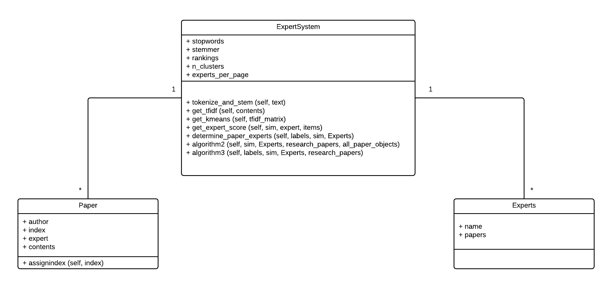

# Automatic Paper-Reviewer Assignment System

This is our project for Paradigms of Programming course.

The objective is to create a system which takes as input the details of an expert and recommends them to a suitable candidate.

## CONTRIBUTORS
[Adrian McDonald Tariang]() - 111501001
[Akshat Choube]() - 111501031
[Harsh Yadav]() - 111501009

## Introduction
In a medium-to-large scale conference, there are thousands of research papers submitted, with only a limited number of reviewers for these papers in this regard. One of the problems that needs attention in such research conferences is that of assigning any submitted paper to be reviewed by an expert on the basis of their expertise in the field of which the paper belongs. It is manually nearly impossible to go through each paper and find a suitable expert in the field to review it, considering we will be needing not only the category the paper belongs to but also the expertise field of the expert based on the papers they have written in the past. This is where automation comes into play and the need for an automatic paper-reviewer assignment system becomes imperative.

In this paper we have tried to tackle this problem with efficiency and accuracy in mind. We put forth two algorithms for the same. The first algorithm assigns the experts who have a paper in closest distance to this paper. The second algorithm is a hybrid of content-based filtering and collaborative filtering. We cluster all the papers (including those of the experts) and for each cluster, each expert has an overall rating which describes the expert’s expertise in that cluster. And then the semi-supervised clustering algorithm assigns papers that we have to recommend to the experts which have high expertise in that cluster.

## Algorithm
A machine learning problem has three major parts:
1. Pre-processing
2. Algorithm
3. Testing

## Pre-processing:
The data-set used by us was the [dblp dataset](http://dblp.uni-trier.de/faq/How+can+I+download+the+whole+dblp+dataset) had information about reviewers and papers to be reviewed.
We have three major entities:
1. Expert
2. Paper
3. ExpertSystem

The UML diagram depicts the attribute of the entities

We extract our entities from raw data in dataset. As our dataset contains some non-UTF8 characters, we need to remove them in our pre-processing phase. We assign unique ID to each paper.

We use sklearn built-in function to generate tfidf matrix for all papers  using our custom tokenizer which removes stopwords and does the necessary stemming.

After getting the tfidf matrix, we generate similarity matrix using cosine similarity between papers.

## Algorithm:
As mentioned earlier, we proposed two algorithms, both of which try to capture different aspects of <>

__Algorithm I__
- For each paper in research_papers (papers which need recommendation)
- Go to ith row of similarity matrix where i is unique index of paper.
- Do argsort() of ith row in descending order (this returns unique index of papers which are closest to the given paper)
- Choose expert_per_paper number which are written by experts from top (this returns top expert_per_paper number closest to given paper)
- Recommend given paper to the authors of the papers returned in step 3

__Algorithm II__
- Cluster all papers into k-clusters using TFIDF matrix and get labels for each paper.
- For each cluster :
  + For each expert :
    * For each paper in cluster :
    * Ranking[cluster][expert] = Ranking[cluster][expert] + maximum similarity (paper, paper*) where paper* is a paper written by given expert
- For each paper in research_paper (papers which need recommendation)
  + Get cluster to which the paper belongs as paper_cluster
  + Recommend top expert_per_paper number of experts in the cluster using ranking matrix obtained in previous step.

## Testing
- The Script executes by running `driver.py`
- Algorithm2 best works with `n_clusters` value 4 or 6
- Testing was performed by running the output through [evaluation/evaluate.py](evaluation/evaluate.py)
